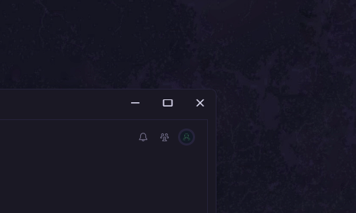

# customControls

Replaces the titlebar's original minimum, maximum, and close buttons with custom ones. (w/ limitations)

## Preview

## Modification

Just inspect element then save your edits through the marketplace's add css snippet function or through your theme's local CSS file.

The settings menu contains the following options:
-   having the maximize button toggle fullscreen instead of window resizing
-   choosing between several preset control button styles

## Limitations

-   minimize button is not functional
-   maximize button implementation:
    -   removes window animations
    -   removes the Windows snap layouts on hover
    -   does not do actual "maximized" window state
-   close button implementation:
    -   ignores the Spotify option to hide to tray

## Credits

-   [darkthemer](https://github.com/darkthemer/) : authored this extension
-   [OhItsTom](https://github.com/ohitstom/) : made [noControls.js](https://github.com/ohitstom/spicetify-extensions/tree/main/noControls) possible
-   [kyrie25](https://github.com/kyrie25/) : extension settings code as template
-   [niivu](https://www.deviantart.com/niivu) : control button designs as inspiration